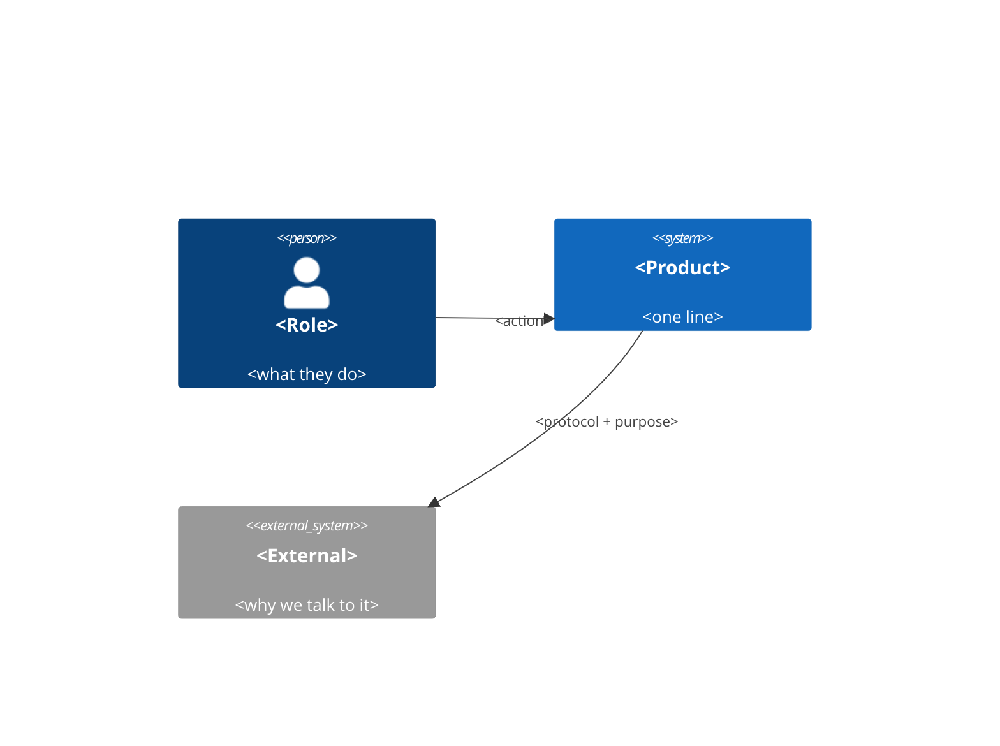

# $product-architecture — stage 6: the shape, and why it's that shape

**Version:** product family 1.0.0

<!-- codex-port: Codex frontmatter permits only name and description, so the
     version lives here in the body. Read it from this line when stamping a
     plan's planner-version / executor-version. -->


The first HOW stage. An arc42-shaped document with C4 diagrams for the views and ADRs for the decisions — arc42 supplies what C4 omits (quality attributes, crosscutting concerns, risks), and C4 supplies the pictures arc42 leaves abstract.

The document's job is not to describe a structure. It is to make the **quality attributes** the reason for the structure, so a later reader can tell which parts are load-bearing and which are incidental.

## Steps

1. **Read** `docs/requirements.md` (the non-functional requirements are the real input — they are the quality attributes with numbers already attached), `docs/roadmap.md` (v3's direction, which the architecture must not preclude), and `docs/prd.md` (constraints). Brownfield: document the architecture that exists before proposing any change, and mark every proposed change as such.

2. **Rank the quality attributes.** Unranked, they all conflict and nothing is decided. Name the top three and what each trades away. This ranking is the document's spine.

3. **Draw the C4 views** as mermaid, top down, stopping when the next level stops earning its keep:
   - **Context** — the system, its users, and the systems it talks to. Always.
   - **Container** — the deployable/runnable pieces and the protocols between them. Almost always.
   - **Component** — inside a container, only where the internal structure is genuinely non-obvious.

4. **Write the crosscutting concerns** — the decisions that would otherwise be made inconsistently in twenty places: identity and authorization, error handling and retries, observability, configuration, data lifecycle, i18n.

5. **Record every real decision as an ADR**, including the ones that felt obvious. An obvious-seeming decision with no recorded alternative is the one that gets reversed by accident later.

6. **Rule on every dependency** — License and Cost, explicitly. See below.

7. **Route UI scope to `$uxmaster`.** If the product has an interface, the architecture states the platform and its constraints; it does not design screens. `$uxmaster` owns interface design and its findings ledger.

## Licence and cost — the standing default

**Free and permissive, unless an argument survives being written down.**

- **Permitted:** MIT, BSD, Apache-2.0, ISC, MPL-2.0.
- **Not by default:** GPL, LGPL, AGPL, SSPL — and no paid service, subscription or metered account.

To adopt anything outside that, the ADR must name the free equivalent, say specifically what it cannot do, and say whether the obligation even attaches — *linking a library is not the same as running a container*, and that distinction decides most copyleft questions correctly. A paid or copyleft choice is then the user's decision to make at the gate, never a default this stage takes quietly.

Every dependency in the table carries a `License:` and a `Cost:` value. `Cost: free` is a claim; check it.

## Output — `docs/architecture.md`

```markdown
# <Product> — Architecture

**Date:** <YYYY-MM-DD>  ·  **Horizon:** v3.0

## Quality attributes, ranked
| # | Attribute | Requirement | Trades away |
|---|---|---|---|
| 1 | <e.g. durability> | R-31, R-40 | <what it costs us> |
| 2 | … | | |
| 3 | … | | |

<One paragraph: why this order, and what would change it.>

## Context


## Containers
```mermaid
C4Container
  …
```
| Container | Responsibility | Why separate |
|---|---|---|

## Components
<Only where the internal structure isn't obvious from the container view.>

## Data
<The entities, their relationships, and what owns each one. Retention and deletion — the parts everyone forgets until a regulator asks.>

## Crosscutting concerns
**Identity & authorization:** <…>
**Errors & retries:** <…>
**Observability:** <what is logged, measured, traced — and how an on-call person finds a failure>
**Configuration:** <where it lives, how it changes, what is secret>
**Data lifecycle:** <retention, deletion, export>

## Dependencies
| Dependency | Purpose | License | Cost | Alternative considered |
|---|---|---|---|---|
| <name> | <why> | Apache-2.0 | free | <what else, and why not> |

## Decisions (ADR)
### ADR-001 — <title>
**Status:** accepted | superseded by ADR-00N  ·  **Date:** <YYYY-MM-DD>
**Context:** <the forces, including which ranked quality attribute drove this>
**Decision:** <what we're doing>
**Alternatives:** <what else, and specifically why not>
**Consequences:** <what this makes easy, what it makes hard, what it forecloses>

## v3 headroom
<What this architecture must not preclude, from the roadmap's v3 direction. The point of writing it down is to notice when a v1 decision quietly kills a v3 intention.>

## Risks
| Risk | Quality attribute at stake | Early warning |
|---|---|---|

## Open questions
- [NEEDS CLARIFICATION] <question>
```

## Rules

1. **Quality attributes are ranked, and the ranking is justified.** An unranked list decides nothing.
2. **Every structural choice traces to a ranked attribute or an ADR.** Structure without a reason is structure nobody can safely change.
3. **C4 stops when it stops earning its keep.** A component diagram of something obvious is noise. Context and container are almost always worth it; code-level diagrams essentially never are here.
4. **Every dependency carries License and Cost.** No exceptions, including transitive dependencies you are knowingly pulling in.
5. **Copyleft or paid requires a written argument** naming the free equivalent and what it can't do — and it goes to the user at the gate as a decision, not into the doc as a fait accompli.
6. **ADRs record alternatives.** "We chose X" without "instead of Y, because Z" is not a decision record.
7. **Brownfield documents what is, before proposing what should be** — and marks every proposal clearly as a proposal.
8. **No screen design.** Platform and constraints here; `$uxmaster` owns the interface.
9. **Don't specify the build.** Stack versions, toolchain, CI, deployment and test strategy are stage 7.
